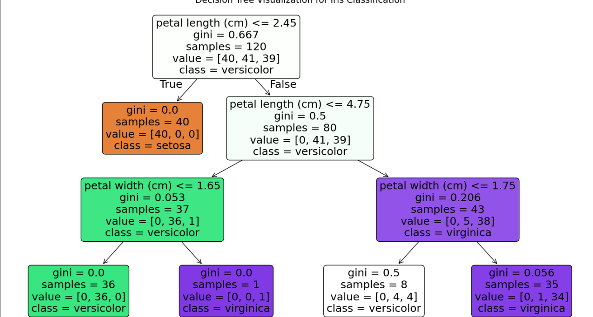

# CODTECH IT SOLUTIONS MACHINE LEARNING INTERNSHIP

## TASK 1: DECISION TREE IMPLEMENTATION

### Project Overview
[cite_start]This project involves building and visualizing a **Decision Tree** model using the `scikit-learn` library[cite: 23]. [cite_start]The goal is to classify outcomes based on the Iris Dataset and provide a clear visualization of the model's decision-making logic[cite: 24].

### Task Details
* [cite_start]**Organization**: CODTECH IT SOLUTIONS [cite: 1, 15]
* **Intern Name**: Purvi Ganvir
* **Intern ID**: CTIS6235
* [cite_start]**Domain**: Machine Learning [cite: 5, 6]
* **Duration**: 17th Feb to 17th March
* **Mentor**: Muzzamail

### Technical Roadmap
1.  **Dataset Selection**: Utilized the Iris dataset, which contains 150 samples of iris flowers with four physical features.
2.  **Preprocessing**: Split the data into training (80%) and testing (20%) sets to ensure model validity.
3.  [cite_start]**Model Building**: Implemented a `DecisionTreeClassifier` with a limited depth to ensure readability[cite: 23].
4.  [cite_start]**Evaluation**: Analyzed the model using accuracy scores and detailed classification reports[cite: 25].
5.  [cite_start]**Visualization**: Generated a graphical representation of the decision tree to show how the model splits data based on feature values[cite: 24].

---

### Model Visualization Output
Below is the visualization of the Decision Tree logic:

---

### Tools & Technologies Used
* **Python**: Core programming language.
* [cite_start]**Scikit-Learn**: For model building and dataset access[cite: 23].
* **Matplotlib**: For generating the decision tree plot.
* **Pandas**: For data structure and analysis.
* **Google Colab**: Environment used for development.

### How to Run
1. [cite_start]Clone this repository[cite: 86].
2. Open the `.ipynb` file in Google Colab or Jupyter Notebook.
3. Run all cells to see the data loading, training, and visualization steps.

### Deliverables
* [cite_start]A functional Jupyter Notebook containing the code and analysis[cite: 24].
* [cite_start]A visualized model plot explaining the classification steps[cite: 24].
